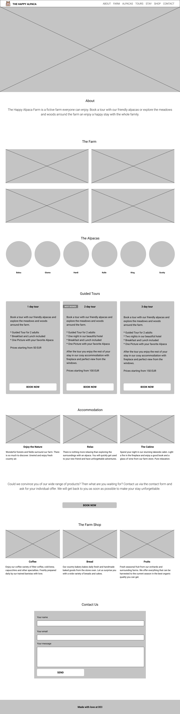
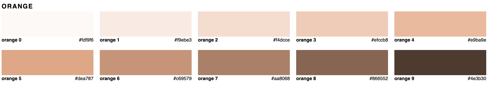

# The Happy Alpaca

A client, the owner of an alpaca farm, commissioned you to design and develop a website to promote their farm online.

## General Information

- You have 3 days to complete your project. Plan ahead and try to stay within this time frame, working from roughly 9.00 to 16.00.
- The project will be done during class hours, so you'll always have a teacher to support you if necessary.
- You'll be expected to make a short 15 minute presentation of the project: explain how you managed the project (from planning to design to code), what went well and what you would like to improve next time.
- This is not a competition! It's a way to collaborate, practice and learn.

## Instructions

Using the assets provided (wireframe, color palette, images, design a landing page to present to the client.

### Planning

- Plan ahead as much as possible: before starting to work on the design or to code, try to come up with a reasonable schedule that fits the 3 days available
- Divide the project in small and smaller tasks
- Divide tasks between team members
- Decide if you want to make your custom design first (on Figma, for example) or jump directly to code using a framework (Bootstrap, for example)
- Nominate a project manager, if necessary, she/he will take care of the project status and internal organisation

### Design

- Use the wireframe below as a reference to create your own design for the website
- Use the images from the `images` folder where necessary and according to your taste
- Primary and accent colors, together with a set of grays, are provided

**IMPORTANT**: try to spend a maximum of about 2 hours on the design, you can always adjust things later

#### Notes

- the wireframe serves only as a guideline, to give you an idea of the layout and where to put the content, but the actual design is completely up to you
- the client will not give you feedback on the design, just come up with something which you as a group think is appropriate
- be creative and feel free to experiment
- don't focus too much on the design so that you don't get stuck at the beginning, you can always refine and adjust things later

## Wireframe

## Color system

There are 4 main colors to use in the project and from those colors a large set of tints has been generated.

### Main colors

### Primary color tints

### Accent color tints

### Gray tints

### Notes on Colors

- Use colors wisely: there are many available, but you don't have to use all of them, only what you need
- Try to pair colors carefully: primary and accent colors are both very strong, so be careful to use them together. Try to rely on lighter tints when you have to combine more than one color
- For texts, you might try to use the main dark color, which is not a full black
- Same for white - instead of a full white, it might be better to use the lighter shade
- If you don't like the colors provided, feel free to come up with your own

**Resources**

- Useful article on how to build/use a color palette: [Building your color palette](https://refactoringui.com/previews/building-your-color-palette/)
- Tints and shades generator: [maketintsandshades.com/](https://maketintsandshades.com/)
- Another one, including grays: [palx.jxnblk.com/](https://palx.jxnblk.com/)

## Development

After having come up with some ideas for a design, implement them with HTML and
CSS. Use any of the things you've learned with no restriction. Feel free to use
Flexbox, Grid, Bootstrap (if you like it) or none of the above.

- Create and use one Git repository for the project, where the whole team can
  collaborate
- Try to use a mobile-first approach
- Create a project boilerplate together as starting point for the tasks (HTML, CSS/SCSS file with general CSS e.g Reset CSS and Fonts)
- As a team, try to discuss and adhere to some coding conventions for the project (e.g. SCSS or CSS, BEM, indendantion etc.)
- work on Git branches and Pull Requests as much as possible and keep the `main` branch clean and always with a working version
