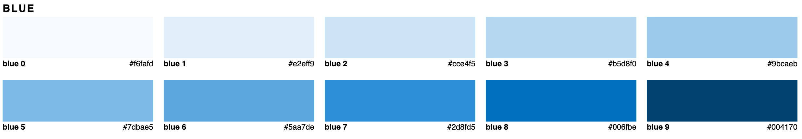
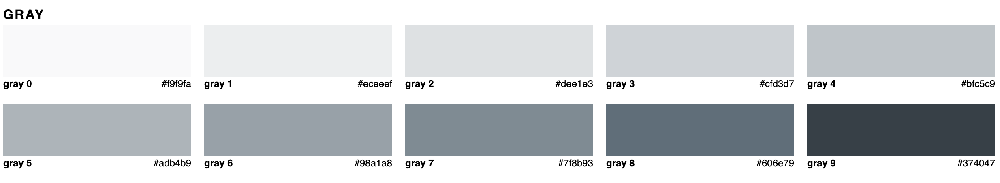

# Das fröhliche Alpaka

Ein Kunde, der Besitzer einer Alpakafarm, hat dich beauftragt, eine Website zu entwerfen und zu entwickeln, um seine Farm online zu bewerben.

## Allgemeine Informationen

- Du hast 3 Tage Zeit, um dein Projekt abzuschließen. Plane voraus und versuche, innerhalb dieses Zeitrahmens zu bleiben, indem du ungefähr von 9.00 bis 16.00 Uhr arbeitest.
- Das Projekt wird während der Unterrichtszeiten durchgeführt, sodass du immer einen Lehrer zur Unterstützung hast, wenn nötig.
- Es wird erwartet, dass du eine kurze 15-minütige Präsentation des Projekts machst: Erkläre, wie du das Projekt gemanagt hast (von der Planung über das Design bis zum Code), was gut gelaufen ist und was du das nächste Mal verbessern möchtest.
- Dies ist kein Wettbewerb! Es ist eine Möglichkeit zur Zusammenarbeit, Übung und zum Lernen.

## Anweisungen

Verwende die bereitgestellten Ressourcen (Wireframe, Farbpalette, Bilder), um eine Landing Page für den Kunden zu entwerfen.

### Planung

- Plane so viel wie möglich im Voraus: Bevor du mit dem Design oder dem Programmieren beginnst, versuche, einen vernünftigen Zeitplan zu erstellen, der in die 3 verfügbaren Tage passt.
- Teile das Projekt in kleine und kleinere Aufgaben auf.
- Teile Aufgaben zwischen den Teammitgliedern auf.
- Entscheide, ob du zuerst dein individuelles Design erstellen möchtest (zum Beispiel auf Figma) oder direkt mit dem Codieren mit einem Framework (zum Beispiel Bootstrap) beginnen möchtest.
- Ernenne einen Projektmanager, falls nötig, er/sie wird sich um den Projektstatus und die interne Organisation kümmern.

### Design

- Verwende das untenstehende Wireframe als Referenz, um dein eigenes Design für die Website zu erstellen.
- Verwende die Bilder aus dem `images` Ordner, wo nötig und nach deinem Geschmack.
- Primäre und Akzentfarben, zusammen mit einer Reihe von Grautönen, werden bereitgestellt.

**WICHTIG**: Versuche, maximal etwa 2 Stunden für das Design zu verwenden, du kannst später immer noch Dinge anpassen.

#### Anmerkungen

- Das Wireframe dient nur als Leitfaden, um dir eine Vorstellung vom Layout und der Platzierung des Inhalts zu geben, aber das tatsächliche Design liegt ganz bei dir.
- Der Kunde wird dir kein Feedback zum Design geben, denke dir einfach etwas aus, von dem du als Gruppe denkst, dass es passend ist.
- Sei kreativ und experimentiere ruhig.
- Konzentriere dich nicht zu sehr auf das Design, damit du nicht am Anfang stecken bleibst, du kannst später immer noch Dinge verfeinern und anpassen.

## Wireframe

## Farbsystem

Es gibt 4 Hauptfarben, die im Projekt verwendet werden sollen, und aus diesen Farben wurde eine große Palette von Tönen generiert.

### Hauptfarben

### Primäre Farbtöne

### Akzentfarbtöne

### Grautöne

### Anmerkungen zu den Farben

- Verwende die Farben klug: Es gibt viele zur Auswahl, aber du musst nicht alle verwenden, nur das, was du brauchst.
- Versuche, die Farben sorgfältig zu kombinieren: Primär- und Akzentfarben sind beide sehr stark, also sei vorsichtig, wenn du sie zusammen verwendest. Versuche, dich auf hellere Töne zu verlassen, wenn du mehr als eine Farbe kombinieren musst.
- Für Texte könntest du versuchen, die Hauptfarbe Dunkel zu verwenden, die kein vollständiges Schwarz ist.
- Gleiches gilt für Weiß - anstelle eines vollen Weiß könnte es besser sein, den helleren Ton zu verwenden.
- Wenn dir die bereitgestellten Farben nicht gefallen, kannst du gerne deine eigenen erstellen.

**Ressourcen**

- Nützlicher Artikel darüber, wie man eine Farbpalette erstellt/verwendet: [Building your color palette](https://refactoringui.com/previews/building-your-color-palette/)
- Generator für Töne und Schattierungen: [maketintsandshades.com/](https://maketintsandshades.com/)
- Ein weiterer, einschließlich Grautönen: [palx.jxnblk.com/](https://palx.jxnblk.com/)

## Entwicklung

Nachdem du einige Ideen für ein Design entwickelt hast, setze sie mit HTML und CSS um. Verwende alles, was du gelernt hast, ohne Einschränkungen. Du kannst gerne Flexbox, Grid, Bootstrap (wenn es dir gefällt) oder keines davon verwenden.

- Erstelle und verwende ein Git-Repository für das Projekt, in dem das gesamte Team zusammenarbeiten kann.
- Versuche, einen Mobile-First-Ansatz zu verwenden.
- Erstelle gemeinsam eine Projekt-Boilerplate als Ausgangspunkt für die Aufgaben (HTML, CSS/SCSS-Datei mit allgemeinem CSS z.B. Reset CSS und Fonts).
- Als Team, versucht, einige Codierungskonventionen für das Projekt zu diskutieren und einzuhalten (z.B. SCSS oder CSS, BEM, Einrückung usw.).
- Arbeite so viel wie möglich mit Git-Branches und Pull Requests und halte den `main` Branch sauber und immer mit einer funktionierenden Version.
